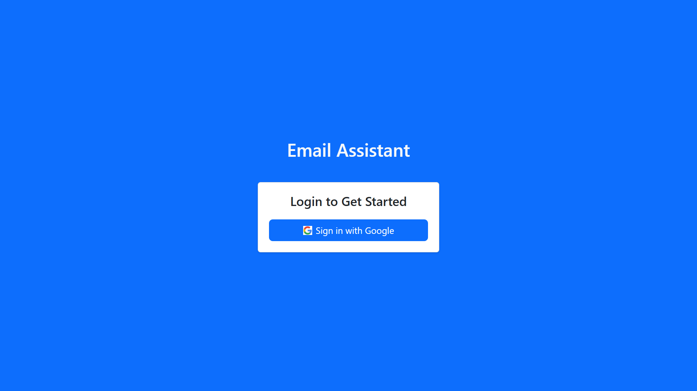
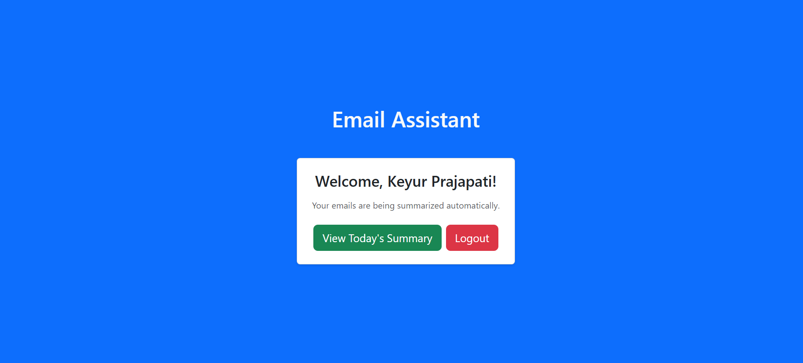
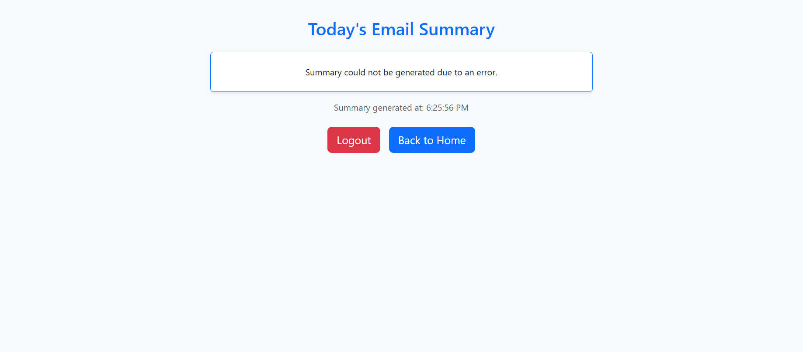

# 📧 AI Email Summarizer & Responder Agent 


This project is an AI-powered email assistant built with Express.js.  
It connects to Gmail using Google OAuth2 (via Passport.js), fetches daily emails, summarizes them using OpenAI, and creates draft replies.

---

### 📁 Folder Structure

```
AI Email Summarizer & Responder Agent/
 ┣ 📄 server.js
 ┣ 📄 config.js
 ┣ 📄 gmail.js
 ┣ 📄 openai.js
 ┣ 📄 package.json
 ┗ 📂 routes
    ┣ 📄 auth.js
    ┗ 📄 email.js
```

---

## 🛠️ Tech Stack  

This project is built with the following technologies:  


---
## ⚙️ Prerequisites

- **Node.js** installed  
- A **Google Cloud** Project with **Gmail API** enabled  
- **OpenAI** API key  

---

## 🚀 Setup Instructions  

**1. Clone the repo**
```bash
git clone https://github.com/your-username/ai-email-agent.git
cd ai-email-agent
```

**2. Install dependencies**
```bash
npm install
```

---

## 🔑 Step 1: Get Google API Keys

&emsp;1. Go to ➡️ [Google Cloud Console](https://console.cloud.google.com/welcome/new)  
&emsp;2. Create a **new project**  
&emsp;3. Go to **APIs & Services → Library**  
&emsp;&emsp;&emsp; - Search and Enable **Gmail API**  
&emsp;4. Go to **APIs & Services → Credentials**  
&emsp;&emsp;&emsp; - Click **Create Credentials → OAuth Client ID**  
&emsp;&emsp;&emsp; - Choose **Web Application**  
&emsp;&emsp;&emsp; - Add **Authorized redirect URI**  
```
http://localhost:3000/auth/google/callback
```
&emsp;&emsp;&emsp; - Copy **Client ID** and **Client Secret**  

---

## 🤖 Step 2: Get OpenAI API Key  

&emsp;1. Go to ➡️ [OpenAI API Keys](https://platform.openai.com/api-keys)  
&emsp;2. **Copy your existing key** or **Create new Secret Key**  

---

## 📄 Step 3: Create .env File  

```env
GOOGLE_CLIENT_ID=your_google_client_id
GOOGLE_CLIENT_SECRET=your_google_client_secret
OPENAI_API_KEY=your_openai_api_key
SESSION_SECRET=supersecret
GOOGLE_CALLBACK_URL=http://localhost:3000/auth/google/callback
```

---

## ▶️ Step 4: Run the Project  

```bash
node server.js
# or
npx nodemon
# or
nodemon server.js
```

Then open ➡️ [http://localhost:3000](http://localhost:3000)  

---

## 🖥️ Screenshots  

### 🔑 Google Sign-In  
👉 Click on **"Sign in with Google"** to authenticate.  
  

### 📬 Gmail Authentication  
Authenticate using your Google account.  
  

### 📊 Dashboard  
After login, you’ll see your daily summary dashboard.  
  

### 📑 AI-Generated Summary  
👉 Click on **"View Today's Summary"** (may take a few moments).  
  

 ### 🚨 **OpenAI Free Tier Limitation** 
- If you are using the **free OpenAI API key**, after processing a larger number of emails, you may encounter an **API error (429 - quota exceeded)**.  
- In this case, the app will show a message in the draft:  
  *`Draft not created due to OpenAI API limit or error.`*  
- If you upgrade to a **paid OpenAI plan**, the app will generate proper **summaries** and **draft replies** without this limitation.  

---

## 🌐 Connect with Me 

I’m **Keyur Prajapati** — let’s connect and collaborate! 🚀  

[](https://github.com/Keyur0206)
[](https://x.com/keyurdhameshiya)
[](https://www.linkedin.com/in/keyur-prajapati-34a385283/)
[](https://www.instagram.com/keyur_dhameshiya_02)
[](https://portfolio-website-keyur-dhameshiya-33.vercel.app/)

---
